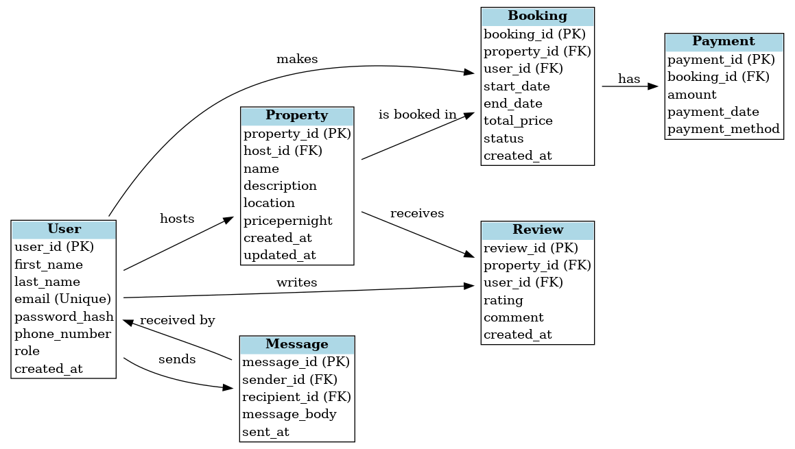

# ER Diagram Requirements

This ERD models an Airbnb-like database system.

## Entities:
- User
- Property
- Booking
- Payment
- Review
- Message

## Relationships:
- A User can host many Properties
- A User can make many Bookings
- A Property can have many Bookings 
- A Booking has one Payment

